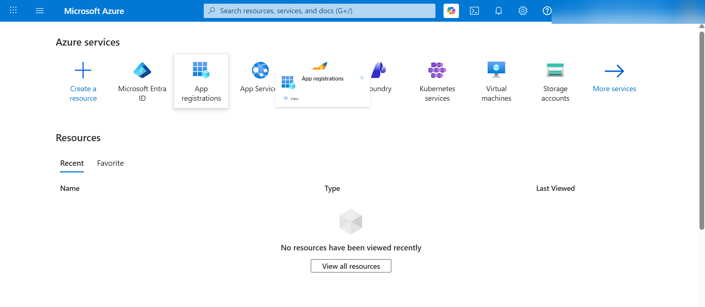
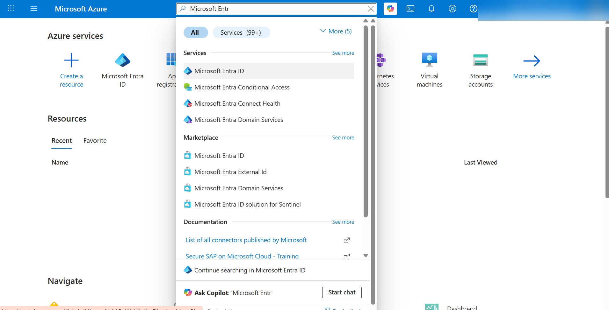
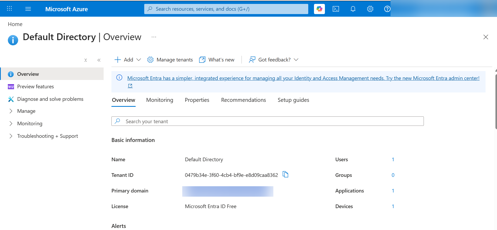
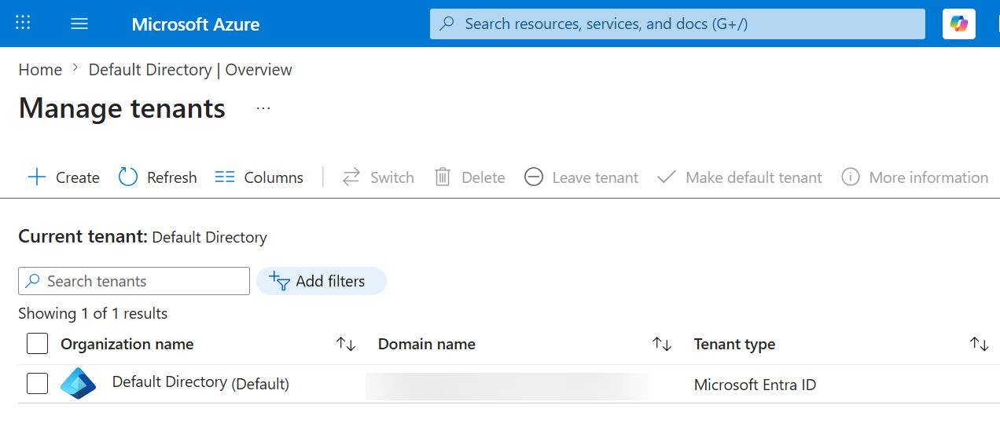
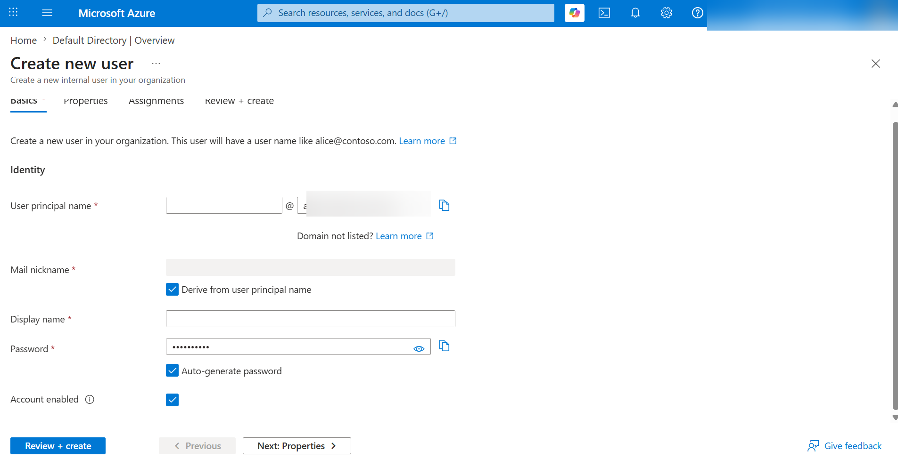
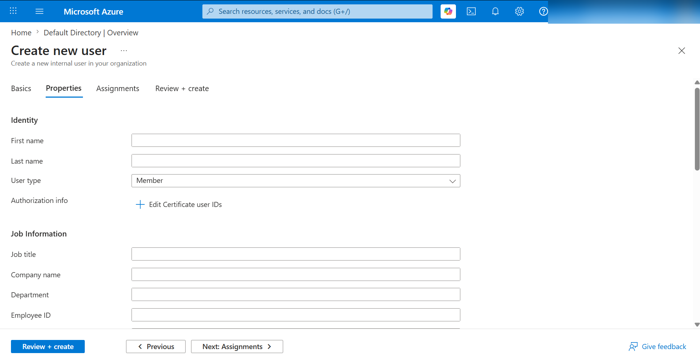
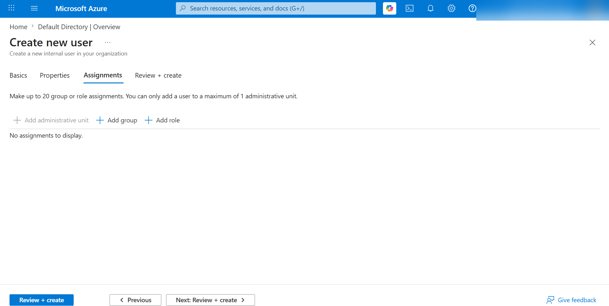
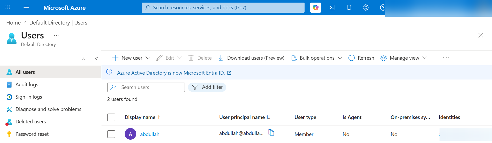
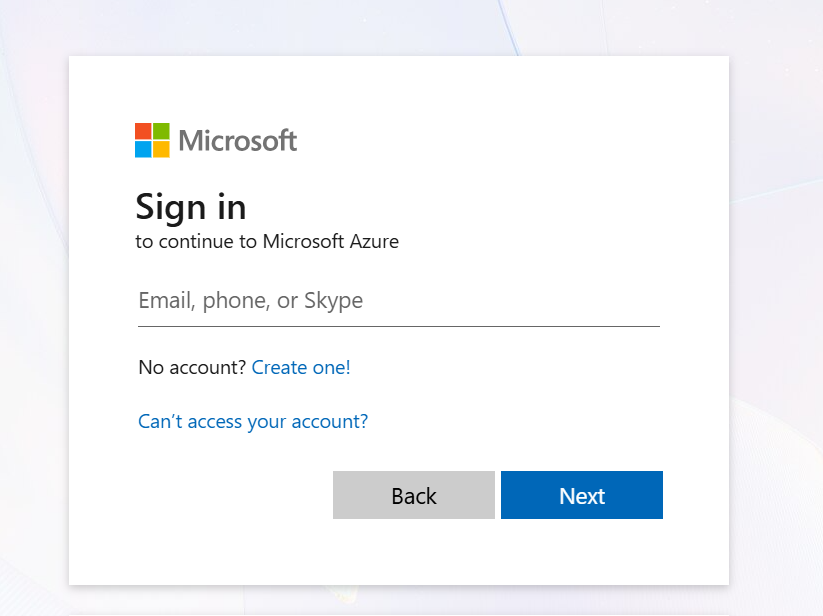
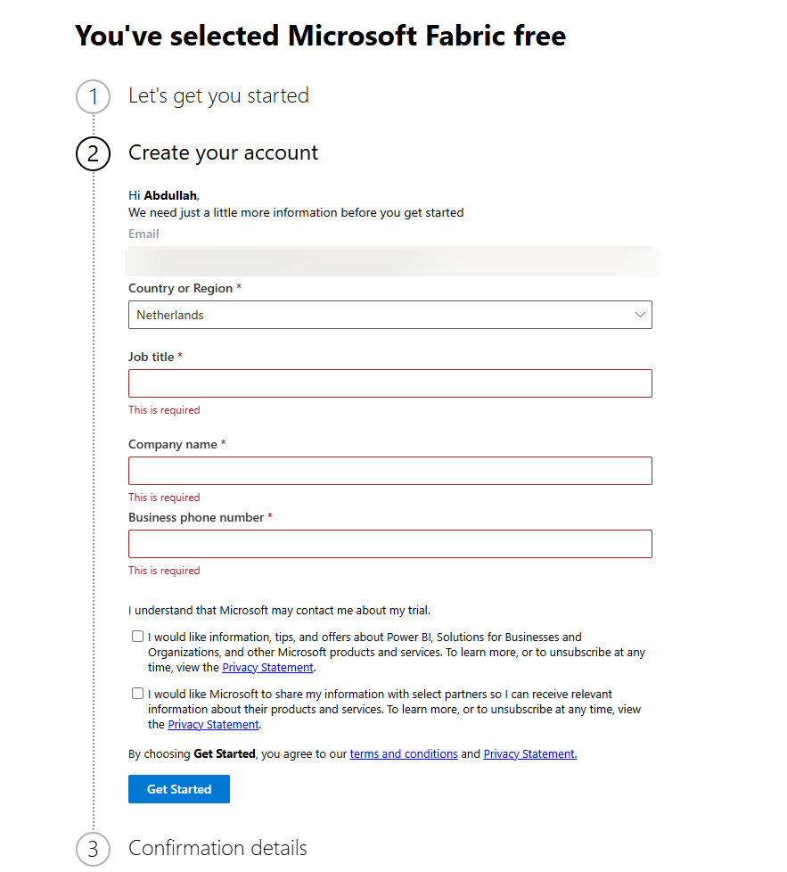

# Get Power BI Service for Free — via Azure & Microsoft Entra ID

A walkthrough for Power BI learners who need to sign into **app.powerbi.com or desktop** to practice Power BI Service features (workspaces, publishing reports, sharing dashboards), but don't have a work or school account.

The trick: Power BI Service requires a *work or school* account; it won't accept personal Outlook/Gmail addresses. So we create our **own** work/school account inside the free Microsoft Entra tenant Azure provisions for you.

---

## What you'll end up with

- A free Azure account (no charges if you stay on free tiers).
- A work/school user, e.g. `you@yourname.onmicrosoft.com`.
- Access to **Power BI Service (Free)** at [app.powerbi.com](https://app.powerbi.com) for course practice.

---

## Before you start

Pick the Azure signup path that fits you:

| Path                         | Who it's for                                                                 | Credit card?                         | Notes                                                                                                                                                                                           |
| ---------------------------- | ---------------------------------------------------------------------------- | ------------------------------------ | ----------------------------------------------------------------------------------------------------------------------------------------------------------------------------------------------- |
| **Azure for Students** | Full-time university students with a `.edu` (or recognized academic) email | **Not required**               | Best option if you qualify. Gives free credit and free services, no card on file.                                                                                                               |
| **Azure Free**         | Everyone else                                                                | Required (for identity verification) | New users get credit for the first 30 days + 12 months of free services. **You can still incur charges if you provision paid resources** — so don't create anything outside the free tier. |

> If you're a student: try Azure for Students first. If verification fails, fall back to Azure Free.

---

## Step 1 — Create your Azure account

1. Go to one of:

   - Students: [https://azure.microsoft.com/free/students](https://azure.microsoft.com/free/students)
   - Everyone else: [https://azure.microsoft.com/free](https://azure.microsoft.com/free). For a step-by-step sign-up walkthrough, see [How to Create a Microsoft Azure Account (Ohio Computer Academy)](https://ohiocomputeracademy.com/blogs/cloud-computing/how-to-create-a-microsoft-azure-account-a-step-by-step-guide/).
2. Sign in with a Microsoft account (personal Outlook/Hotmail works) or create one.
3. Complete identity verification.

   - **Azure Free** requires a phone number and a credit/debit card (used only for identity; you won't be charged unless you upgrade).
   - **Azure for Students** requires academic verification only.
4. Land in the [Azure portal](https://portal.azure.com).

   

---

## Step 2 — Open Microsoft Entra ID

1. In the Azure portal search bar, type **Microsoft Entra ID** and open it.

   
2. You'll see the *default* tenant Azure created for you when you signed up. We'll use this tenant for the rest of the steps.

   

> **What's a tenant?** Think of it as your own private organization inside Microsoft's cloud. It holds users, groups, and access policies. Power BI Service licenses are tied to a tenant.

---

## Step 3 — Make sure you have a tenant

1. Open **Microsoft Entra ID**.
2. Click **Manage tenants**.
3. Check that the default directory tenant is listed.

---

## Step 4 — Add a new user

1. In Entra ID, click **Add → User → Create new user** in the top toolbar.
2. Fill in:

   - **User principal name** — anything readable, e.g. `<yourname>` (the part before the `@`).
   - **Display name** — any display name.
3. Copy the auto-generated password (you'll need it when you sign in).
4. Click **Next: Properties**.

   

---

## Step 5 — Fill in user properties

1. Fill in:

   - **First name** — `<your first name>`.
   - **Last name** — `<your last name>`.
   - **Job title** — `<job title>` (optional).
   - **Company name** — `<your organization name>` (optional).
   - **Address** (optional).
2. Click **Next: Assignments**.

   

You now have a real work/school identity: `abdullah@abdulbi.onmicrosoft.com`.

---

## Step 6 — Review and create

1. Click **Next: Review + Create**.

   

---

## Step 7 — Create the user

1. Click **Create**.

   

---

## Step 8 — Find your new user's email

1. Go to **Microsoft Entra ID → Manage → Users**.
2. Click the newly created user and copy the email address.

   

---

## Step 9 — First sign-in & password reset

1. Open a private/incognito window (so it doesn't conflict with your personal Microsoft account).
2. Go to [https://login.microsoftonline.com](https://login.microsoftonline.com).
3. Sign in with `yourname@abdulbi.onmicrosoft.com` and the password from Step 4.
4. You'll be prompted to **change the password** on first login — set the one you'll actually use.
5. (Recommended) Set up MFA when prompted. The Microsoft Authenticator app is the smoothest option.

---

## Step 10 — Sign into Power BI Service

1. Go to [https://app.powerbi.com](https://app.powerbi.com).
2. Sign in with `yourname@abdulbi.onmicrosoft.com`.
3. First time only: Power BI will provision your workspace. This takes ~30 seconds.
4. You're in. You now have **Power BI Free** — enough for course practice: create reports, build dashboards, use **My workspace**, and publish from Power BI Desktop.

> **Power BI Free vs Pro.** Free lets you author and consume in your own workspace. Sharing with others, app workspaces, and some collaboration features require Pro. For course exercises, Free is enough.

---

## Verifying it works

You should be able to:

- [ ] Open [https://app.powerbi.com](https://app.powerbi.com) and see the Power BI home with your name in the top right.
- [ ] Open **My workspace** from the left sidebar.
- [ ] In Power BI **Desktop**, sign in (top-right) with the same `@abdulbi.onmicrosoft.com` account.
- [ ] **Publish** a `.pbix` report from Desktop into My workspace.

If all four work, you're set.

---

## Cost & safety notes

- Power BI Free, an Entra tenant, and basic users are **all free**.
- Azure Free's credit card is for identity only — Microsoft won't auto-charge unless you explicitly upgrade or provision paid resources (VMs, premium databases, paid Power BI capacity, etc.).
- Stay on the free tier. Don't click "Start free trial" of Power BI **Pro/Premium** unless you mean to — those convert to paid after the trial.
- To be extra safe: in the Azure portal, set a **Cost alert** at $1 so you get notified the moment anything bills.

---

## Troubleshooting

**"You can't sign up here with a personal email."**
You're trying to use Power BI with an `@outlook.com` or `@gmail.com` address. That's the whole reason for this tutorial — sign in with `you@yourname.onmicrosoft.com` instead.

**"Your admin hasn't enabled self-service sign-up."**
Make sure you created the user *inside your default Entra tenant* (Step 4), and that you're signed into Power BI with that user — not your personal Microsoft account.

**Can't see the Users blade in Entra ID.**
Confirm the portal is scoped to your default directory (top-right account menu → **Switch directory**), then revisit Step 3.

**Forgot the auto-generated password.**
Go back to **Entra ID → Users**, open your user, and use **Reset password** to set a new one.

---

## TL;DR

Power BI Service rejects personal emails, so you create a free Azure account, use the default Microsoft Entra tenant it provisions (e.g. `yourname.onmicrosoft.com`), create a user inside that tenant, and sign into `app.powerbi.com` with that user. Use Azure for Students if you qualify (no card needed); otherwise Azure Free is fine as long as you stay on free tiers.
